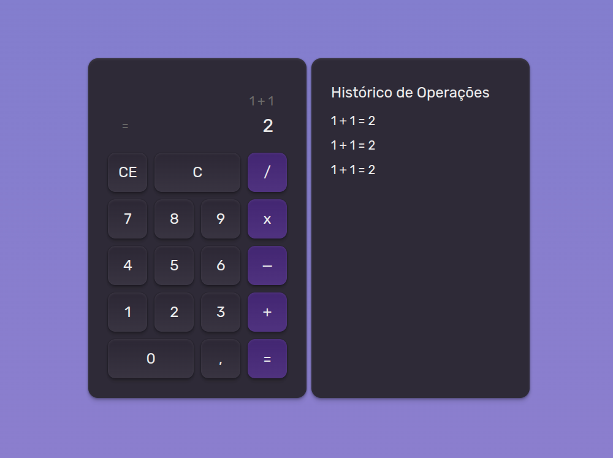

# 🧮 Calculadora React



Uma calculadora simples, moderna e responsiva desenvolvida em **React**, com estilização usando **Tailwind CSS**. Ela conta com um layout dark mode elegante, botões interativos e histórico de operações. Ideal como base para estudos, demonstrações de UI/UX, ou extensão para funcionalidades mais avançadas.

---

## ✨ Funcionalidades

✅ Interface amigável e intuitiva  
✅ Operações básicas (adição, subtração, multiplicação e divisão)  
✅ Botões de limpar (CE e C)  
✅ Histórico de operações exibido em tempo real  
✅ Tema escuro, responsivo e atraente  
✅ Baseada em componentes React

---

## 🚀 Tecnologias

- [React 18](https://react.dev/)
- [Tailwind CSS](https://tailwindcss.com/) (via CDN)
- [Babel](https://babeljs.io/) (compilação no browser)
- HTML5

---

## 🖥️ Preview


---

## 📦 Instalação e Execução

Este projeto não usa bundler nem Node — basta abrir o arquivo `index.html` no navegador.

Se quiser rodar em ambiente local, clone o repositório:

```bash
git clone https://github.com/seu-usuario/seu-repositorio.git
